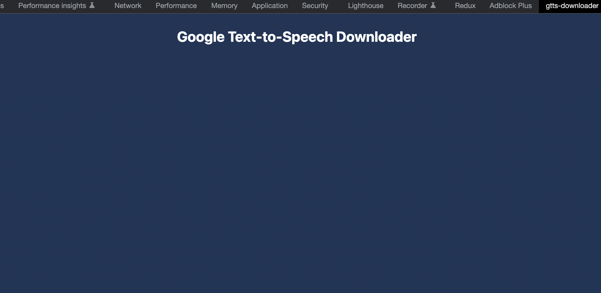
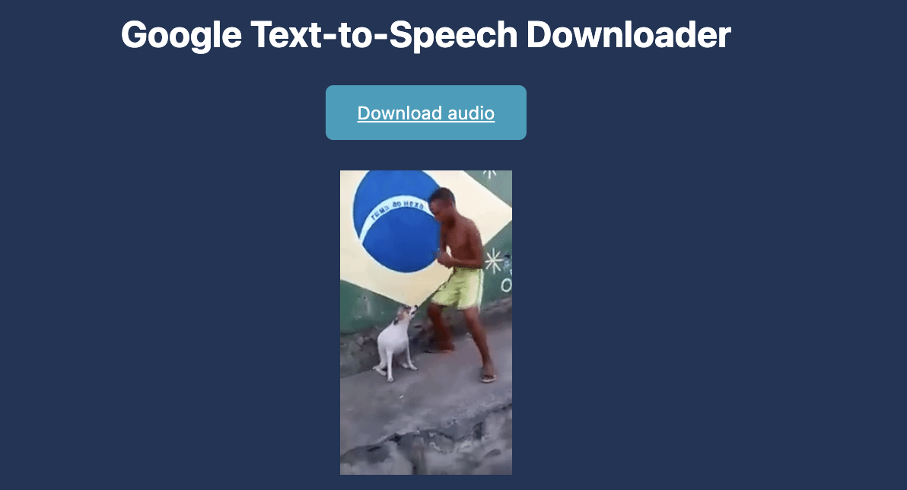

# gtts-downloader

## Load an unpacked extension

The directory holding the manifest file can be added as an extension in developer mode in its current state. To load an unpacked extension in developer mode, follow these steps:

1. Open the Extension Management page by navigating to chrome://extensions.
Alternatively, open this page by clicking on the Extensions menu button and selecting Manage Extensions at the bottom of the menu.
Alternatively, open this page by clicking on the Chrome menu, hovering over More Tools then selecting Extensions
2. Enable Developer Mode by clicking the toggle switch next to Developer mode.
3. Click the Load unpacked button and select the extension directory.

Once loaded go to [google text-to-speech](https://cloud.google.com/text-to-speech) and open the developer tools where you'll find a new tab called `gtts-downloader`

set your text on [google text-to-speech](https://cloud.google.com/text-to-speech), play it and the file audio will be able to download 

